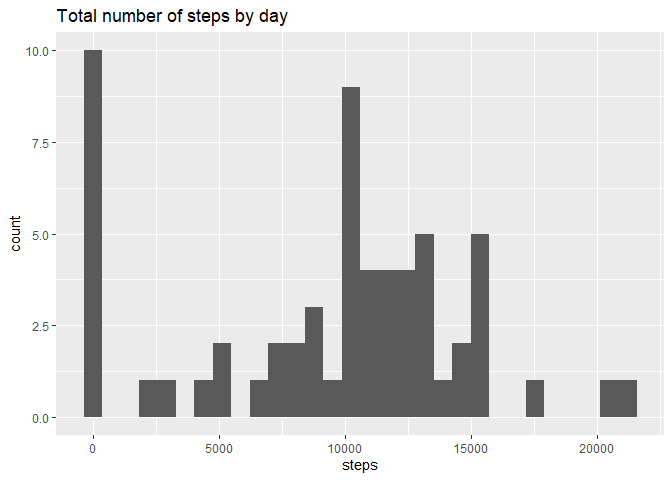
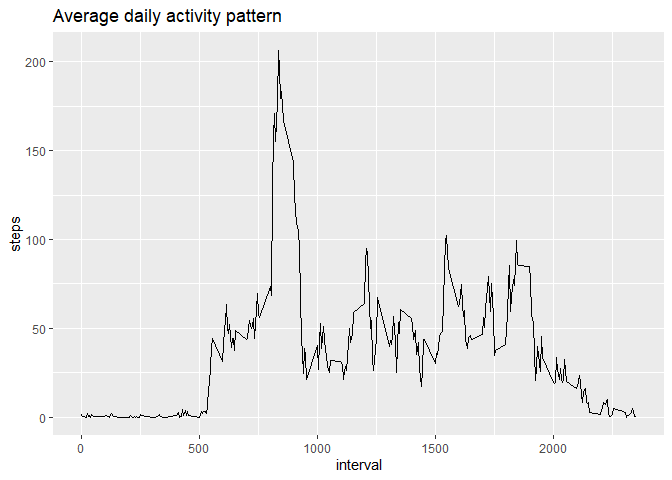
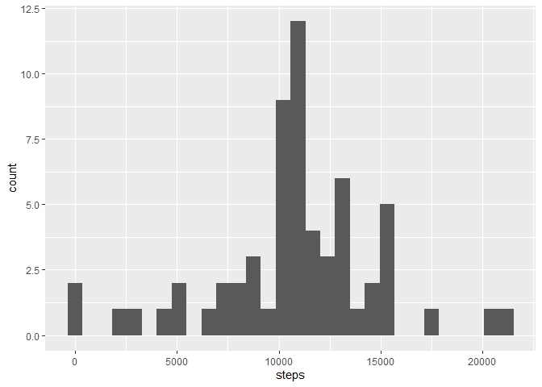
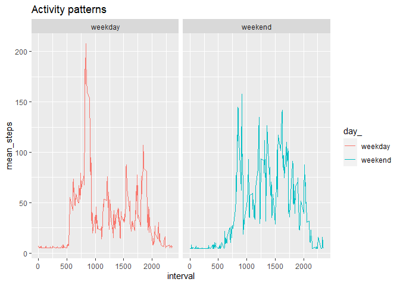

## Data Description

This assignment makes use of data from a personal activity monitoring device. 
This device collects data at 5 minute intervals through out the day. 
The data consists of two months of data from an anonymous individual collected 
during the months of October and November, 2012 and include the number of steps 
taken in 5 minute intervals each day.

The variables included in this dataset are:

- **steps**: Number of steps taking in a 5-minute interval (missing values are coded as \color{red}{\verb|NA|}NA)  
- **date**: The date on which the measurement was taken in YYYY-MM-DD format  
- **interval**: Identifier for the 5-minute interval in which measurement was taken

## Code for reading in the dataset and/or processing the data

```r
# Add libraries
library(tidyverse)
```

```
## -- Attaching packages ---------------------------------------------------------------------------- tidyverse 1.3.0 --
```

```
## v ggplot2 3.3.1     v purrr   0.3.4
## v tibble  3.0.1     v dplyr   1.0.0
## v tidyr   1.1.0     v stringr 1.4.0
## v readr   1.3.1     v forcats 0.5.0
```

```
## -- Conflicts ------------------------------------------------------------------------------- tidyverse_conflicts() --
## x dplyr::filter() masks stats::filter()
## x dplyr::lag()    masks stats::lag()
```

```r
library(Hmisc)
```

```
## Loading required package: lattice
```

```
## Loading required package: survival
```

```
## Loading required package: Formula
```

```
## 
## Attaching package: 'Hmisc'
```

```
## The following objects are masked from 'package:dplyr':
## 
##     src, summarize
```

```
## The following objects are masked from 'package:base':
## 
##     format.pval, units
```

```r
# Get data

file_name <- "repdata_data_activity.zip"

if (!file.exists(file_name)){
    url_of_file <- "https://d396qusza40orc.cloudfront.net/repdata%2Fdata%2Factivity.zip"
    download.file(url_of_file, file_name)
}
# Write file into a variable
activity_data <- read.csv("./data/activity.csv",header = TRUE)

# check the first few rows and str it.
head(activity_data)
```

```
##   steps       date interval
## 1    NA 2012-10-01        0
## 2    NA 2012-10-01        5
## 3    NA 2012-10-01       10
## 4    NA 2012-10-01       15
## 5    NA 2012-10-01       20
## 6    NA 2012-10-01       25
```

```r
str(activity_data)
```

```
## 'data.frame':	17568 obs. of  3 variables:
##  $ steps   : int  NA NA NA NA NA NA NA NA NA NA ...
##  $ date    : chr  "2012-10-01" "2012-10-01" "2012-10-01" "2012-10-01" ...
##  $ interval: int  0 5 10 15 20 25 30 35 40 45 ...
```

## What is mean total number of steps taken per day?


```r
# Sum of steps aggregated by date

activity_data_aggregated_by_date <- activity_data %>%
                                 group_by(date) %>%
                                 summarise(steps = sum(steps, na.rm = TRUE))
```

```
## `summarise()` ungrouping output (override with `.groups` argument)
```

```r
# check the first few rows

head(activity_data_aggregated_by_date)
```

```
## # A tibble: 6 x 2
##   date       steps
##   <chr>      <int>
## 1 2012-10-01     0
## 2 2012-10-02   126
## 3 2012-10-03 11352
## 4 2012-10-04 12116
## 5 2012-10-05 13294
## 6 2012-10-06 15420
```
### Histogram of total number of steps by day


```r
ggplot(activity_data_aggregated_by_date, aes(steps))+
 geom_histogram(bins=30)+
 ggtitle("Total number of steps by day")
```

<!-- -->

### Mean total number of steps per day:

```r
mean(activity_data_aggregated_by_date$steps,na.rm = TRUE)
```

```
## [1] 9354.23
```

### Median total number of steps per day:

```r
median(activity_data_aggregated_by_date$steps, na.rm = TRUE)
```

```
## [1] 10395
```

## What is the average daily activity pattern?


```r
# Average steps aggregated by interval.
average_daily_activity <- activity_data %>%
                                 group_by(interval) %>%
                                 summarise(steps = mean(steps,na.rm = TRUE))
```

```
## `summarise()` ungrouping output (override with `.groups` argument)
```

```r
# Check the first few rows
head(average_daily_activity)
```

```
## # A tibble: 6 x 2
##   interval  steps
##      <int>  <dbl>
## 1        0 1.72  
## 2        5 0.340 
## 3       10 0.132 
## 4       15 0.151 
## 5       20 0.0755
## 6       25 2.09
```

```r
# Time series plot of the 5-minute interval and the average number of steps taken, 
#averaged across all days (y-axis)

ggplot(average_daily_activity,aes(x=interval,y=steps)) +
  geom_line()+
  ggtitle("Average daily activity pattern")
```

<!-- -->
 
 
 ### Which 5-minute interval, on average across all the days in the dataset, contains the maximum number of steps?  
 
 

```r
max_num_steps <- max(average_daily_activity$steps)
max_num_steps
```

```
## [1] 206.1698
```

```r
max_5_min_interval <- average_daily_activity$interval[which(average_daily_activity$steps == max_num_steps)]

max_5_min_interval
```

```
## [1] 835
```
Interval **835 ** on average across all the days in the dataset, 
contains the maximum number of steps (**206.1698113**)

## Imputing missing values


```r
# See the summary to see how many NAs there are.

summary(activity_data$steps)
```

```
##    Min. 1st Qu.  Median    Mean 3rd Qu.    Max.    NA's 
##    0.00    0.00    0.00   37.38   12.00  806.00    2304
```

```r
# or

length(which(is.na(activity_data$steps)))
```

```
## [1] 2304
```
### Devise a strategy for filling in all of the missing values in the dataset.

We will replace NAs with the the mean of the steps in the dataset. 

### Create a new dataset that is equal to the original dataset but with the missing data filled in.


```r
imputed_activity_data <- activity_data

imputed_activity_data$steps <- impute(activity_data$steps,fun = mean)

head(imputed_activity_data$steps)
```

```
## [1] 37.3826* 37.3826* 37.3826* 37.3826* 37.3826* 37.3826*
```

```r
daily_activity_imputed <- imputed_activity_data %>%
                                 select(steps,date,interval) %>%
                                 group_by(date) %>%
                                 summarise(steps = sum(steps))
```

```
## `summarise()` ungrouping output (override with `.groups` argument)
```

```r
daily_activity_imputed
```

```
## # A tibble: 61 x 2
##    date        steps
##    <chr>       <dbl>
##  1 2012-10-01 10766.
##  2 2012-10-02   126 
##  3 2012-10-03 11352 
##  4 2012-10-04 12116 
##  5 2012-10-05 13294 
##  6 2012-10-06 15420 
##  7 2012-10-07 11015 
##  8 2012-10-08 10766.
##  9 2012-10-09 12811 
## 10 2012-10-10  9900 
## # ... with 51 more rows
```
### Make a histogram of the total number of steps taken each day and Calculate and report the mean and median total number of steps taken per day. Do these values differ from the estimates from the first part of the assignment? What is the impact of imputing missing data on the estimates of the total daily number of steps?


```r
ggplot(daily_activity_imputed,aes(x=steps))+
  geom_histogram(bins=30)
```

<!-- -->

```r
mean(daily_activity_imputed$steps)
```

```
## [1] 10766.19
```

```r
median(daily_activity_imputed$steps)
```

```
## [1] 10766.19
```
From the values below, it is evident that there is some change in mean and median when imputing missing values with mean.

### Without NA

 1) Mean   =  9354.2295082
 2) Median = 10395

### After imputing NA with mean

 1) Mean   = 1.0766189\times 10^{4}
 2) Median = 1.0766189\times 10^{4}

## Are there differences in activity patterns between weekdays and weekends?


```r
imputed_activity_data <- imputed_activity_data %>% 
  mutate(day_ = ifelse(weekdays(as.Date(activity_data$date)) %in% c("Saturday","Sunday"), "weekend", "weekday"))


imputed_activity_data <- imputed_activity_data %>% 
  group_by(interval,day_) %>% 
  summarise(mean_steps = mean(steps))
```

```
## `summarise()` regrouping output by 'interval' (override with `.groups` argument)
```

```r
ggplot(imputed_activity_data,aes(x=interval,y=mean_steps,color=day_))+
geom_line() + 
 facet_grid(~day_,)+
  ggtitle("Activity patterns")
```

<!-- -->
